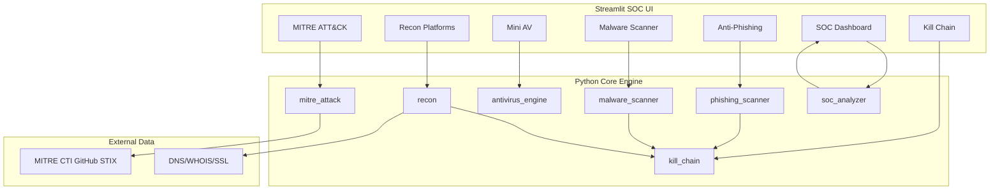

# AI-Powered Anti-Phishing Simulator

[](https://www.python.org/downloads/)
[](https://streamlit.io/)
[](https://attack.mitre.org/)
[](https://attack.mitre.org/)
[](LICENSE)

A **Python-based SOC analyst platform** for anti-phishing simulation, malware triage, multi-platform reconnaissance, Cyber Kill Chain analysis, and live **MITRE ATT&CK** integration — built for blue team defenders.

> **Disclaimer:** This tool is for **authorized defensive security**, SOC training, and phishing awareness simulation only. Reconnaissance and scanning features must only be used against systems you own or have explicit permission to test.

---

## Features

| Module | Description |
|--------|-------------|
| **SOC Dashboard** | Risk gauge, alert queue, blue team action checklist |
| **Anti-Phishing Scanner** | URL heuristics + email header (SPF/DKIM/DMARC) analysis |
| **Malware & Virus Scanner** | File upload, hash lookup, YARA-like rules, entropy analysis |
| **Mini Antivirus** | BlueShield AV Engine — signatures + heuristics |
| **Recon Platforms (×6)** | DNS, WHOIS, SSL/TLS, Port Scan, Subdomain Enum, OSINT |
| **Cyber Kill Chain** | 7-stage Lockheed Martin mapping with SOC playbooks |
| **MITRE ATT&CK** | Live STIX fetch, search, **compare & recommend best result** |
| **AI Prompts** | Balanced JSON prompts for Gemini & Claude |

---

## Architecture



---

## Quick Start

### Prerequisites

- Python 3.10 or higher
- pip

### Installation

```bash
git clone https://github.com/yourusername/ai-powered-anti-phishing-simulator.git
cd ai-powered-anti-phishing-simulator

python -m venv venv

# Windows
venv\Scripts\activate

# Linux/macOS
source venv/bin/activate

pip install -r requirements.txt
```

### Run

```bash
streamlit run app/main.py
```

Or:

```bash
python run.py
```

Open **http://localhost:8501** in your browser.

---

## SOC Analyst Workflow

1. **Triage** — Check SOC Dashboard for open alerts and overall risk score
2. **Investigate** — Run suspicious URLs through Anti-Phishing Scanner
3. **Analyze** — Upload suspicious attachments to Malware Scanner / Mini AV
4. **Recon** — Enumerate attacker infrastructure with 6 recon platforms (authorized targets only)
5. **Map** — Align findings to Cyber Kill Chain stage and follow SOC playbook
6. **Enrich** — Search MITRE ATT&CK for related TTPs; compare techniques for detection rule consolidation
7. **Respond** — Execute blue team actions; document in incident ticket

---

## MITRE ATT&CK Compare — Best Result

The platform fetches live data from [MITRE CTI](https://github.com/mitre/cti) and compares two techniques:

| Factor | Weight |
|--------|--------|
| Shared tactics | 40% |
| Shared platforms | 30% |
| Description similarity | 30% |

**Recommendation tiers:**

- **≥ 70% (HIGH OVERLAP)** — Consolidate detection rules; correlate alerts across both techniques
- **40–69% (MODERATE)** — Map shared detections to SIEM use cases; differentiate by data source
- **< 40% (LOW)** — Distinct techniques; prioritize based on your threat model

Example: Compare `T1566` (Phishing) vs `T1566.001` (Spearphishing Attachment)

---

## Recon Platforms

| Platform | Key Checks |
|----------|------------|
| **DNS Recon** | A, AAAA, MX, NS, TXT, SPF, DMARC |
| **WHOIS Lookup** | Registrar, domain age, name servers |
| **SSL/TLS Analysis** | Certificate validity, SAN, protocol |
| **Port Scanner** | FTP, SSH, SMTP, HTTP/S, SMB, RDP, etc. |
| **Subdomain Enum** | Common subdomain wordlist |
| **OSINT Metadata** | URL validation, hash fingerprinting |

---

## Cyber Kill Chain

Based on the **Lockheed Martin Cyber Kill Chain**:

1. Reconnaissance
2. Weaponization
3. Delivery
4. Exploitation
5. Installation
6. Command & Control
7. Actions on Objectives

Each stage includes MITRE tactic cross-references and a **SOC playbook** with actionable steps.

---

## AI Prompts (Gemini & Claude)

Pre-built JSON prompts for extending this platform with LLMs:

| File | Purpose |
|------|---------|
| `prompts/master_prompt.json` | Unified balanced prompt for any LLM |
| `prompts/gemini_prompt.json` | Optimized for Google Gemini API |
| `prompts/claude_prompt.json` | Optimized for Anthropic Claude API |

View and download prompts in the **AI Prompts** page of the app.

---

## Project Structure

```
ai-powered-anti-phishing-simulator/
├── app/
│   ├── core/
│   │   ├── phishing_scanner.py    # URL & email anti-phishing
│   │   ├── malware_scanner.py     # Malware/virus analysis
│   │   ├── antivirus_engine.py    # Mini AV engine
│   │   ├── recon.py               # 6 recon platforms
│   │   ├── kill_chain.py          # Cyber Kill Chain
│   │   ├── mitre_attack.py        # MITRE ATT&CK integration
│   │   └── soc_analyzer.py        # SOC dashboard logic
│   ├── ui/
│   │   └── components.py          # Dark SOC theme CSS
│   └── main.py                    # Streamlit application
├── prompts/
│   ├── master_prompt.json
│   ├── gemini_prompt.json
│   └── claude_prompt.json
├── requirements.txt
├── run.py
└── README.md
```

---

## Requirements

```
streamlit>=1.32.0
requests>=2.31.0
pandas>=2.1.0
plotly>=5.18.0
dnspython>=2.4.0
python-whois>=0.8.0
validators>=0.22.0
tldextract>=5.1.0
```

---

## Ethical Use Policy

- Use only in **authorized environments** (your lab, employer-approved assessments, training)
- Do **not** scan or recon third-party systems without written permission
- Simulated threat intelligence hashes are for **education/demo** only
- This is **not** a replacement for enterprise EDR/AV/SIEM solutions

---

## Contributing

1. Fork the repository
2. Create a feature branch (`git checkout -b feature/soc-enhancement`)
3. Commit changes (`git commit -m 'Add SIEM log parser'`)
4. Push to branch (`git push origin feature/soc-enhancement`)
5. Open a Pull Request

---

## License

MIT License — see [LICENSE](LICENSE) for details.

---

## Acknowledgments

- [MITRE ATT&CK](https://attack.mitre.org/) — TTP framework
- [MITRE CTI](https://github.com/mitre/cti) — STIX data
- [Lockheed Martin](https://www.lockheedmartin.com/en-us/capabilities/cyber/cyber-kill-chain.html) — Cyber Kill Chain model

---

<p align="center">
  <strong>Built for SOC Analysts · Blue Team · Defensive Security</strong>
</p>
